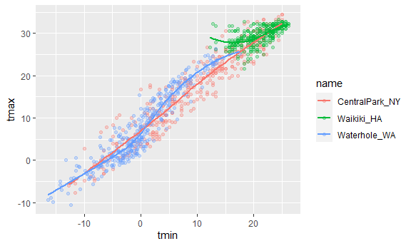
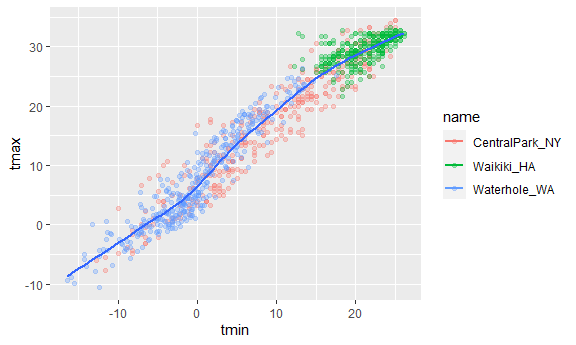
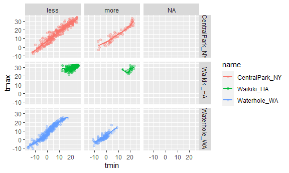
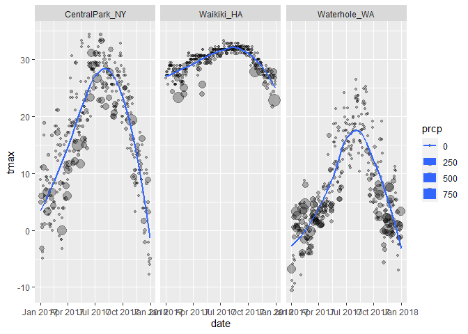
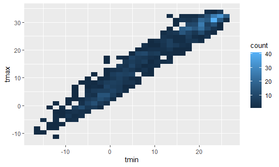
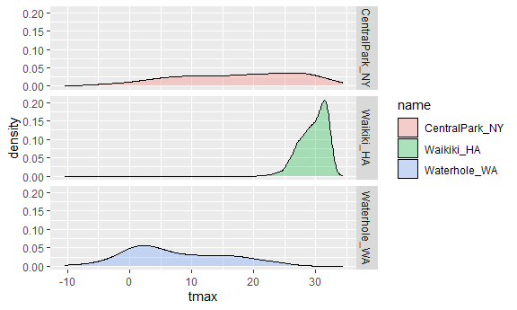
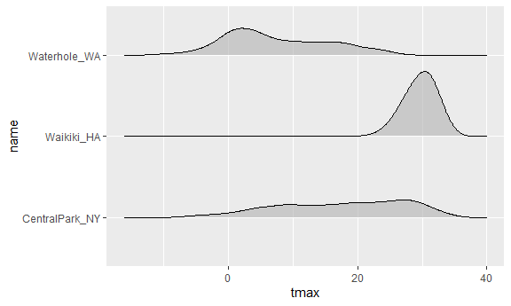

ggplot1
================

``` r
library(tidyverse)
```

    ## -- Attaching packages --------------------------------------- tidyverse 1.3.1 --

    ## v ggplot2 3.3.5     v purrr   0.3.4
    ## v tibble  3.1.4     v dplyr   1.0.7
    ## v tidyr   1.1.3     v stringr 1.4.0
    ## v readr   2.0.1     v forcats 0.5.1

    ## -- Conflicts ------------------------------------------ tidyverse_conflicts() --
    ## x dplyr::filter() masks stats::filter()
    ## x dplyr::lag()    masks stats::lag()

``` r
library(ggridges)
```

Loading a dataset

``` r
weather_df = 
  rnoaa::meteo_pull_monitors(
    c("USW00094728", "USC00519397", "USS0023B17S"),
    var = c("PRCP", "TMIN", "TMAX"), 
    date_min = "2017-01-01",
    date_max = "2017-12-31") %>%
  mutate(
    name = recode(
      id, 
      USW00094728 = "CentralPark_NY", 
      USC00519397 = "Waikiki_HA",
      USS0023B17S = "Waterhole_WA"),
    tmin = tmin / 10,
    tmax = tmax / 10) %>%
  select(name, id, everything())
```

    ## Registered S3 method overwritten by 'hoardr':
    ##   method           from
    ##   print.cache_info httr

    ## using cached file: C:\Users\asus\AppData\Local/Cache/R/noaa_ghcnd/USW00094728.dly

    ## date created (size, mb): 2021-10-12 10:27:32 (7.62)

    ## file min/max dates: 1869-01-01 / 2021-10-31

    ## using cached file: C:\Users\asus\AppData\Local/Cache/R/noaa_ghcnd/USC00519397.dly

    ## date created (size, mb): 2021-10-12 10:27:47 (1.701)

    ## file min/max dates: 1965-01-01 / 2020-02-29

    ## using cached file: C:\Users\asus\AppData\Local/Cache/R/noaa_ghcnd/USS0023B17S.dly

    ## date created (size, mb): 2021-10-12 10:27:54 (0.914)

    ## file min/max dates: 1999-09-01 / 2021-10-31

## scatter plot

``` r
weather_df %>% 
  ggplot(aes(x = tmin, y = tmax)) +
  geom_point()
```

    ## Warning: Removed 15 rows containing missing values (geom_point).

<!-- -->

## save ggplot

``` r
ggp_tmax_tmin = 
  weather_df %>% 
  ggplot(aes(x = tmin, y = tmax)) +
  geom_point()
ggp_tmax_tmin
```

    ## Warning: Removed 15 rows containing missing values (geom_point).

<!-- -->

## Let’s fancy it up

Add color? lines? others?

``` r
weather_df %>% 
  ggplot(aes(x = tmin, y = tmax, color = name)) +
  geom_point(alpha = .3)+  # alpha:transparency 
  geom_smooth(se = FALSE) #add smooth lines
```

    ## `geom_smooth()` using method = 'loess' and formula 'y ~ x'

    ## Warning: Removed 15 rows containing non-finite values (stat_smooth).

    ## Warning: Removed 15 rows containing missing values (geom_point).

<!-- -->

``` r
## Compare the position of aes()

weather_df %>% 
  ggplot(aes(x = tmin, y = tmax)) + ##
  geom_point(aes(color = name),alpha = .3)+ ##
  geom_smooth(se = FALSE) 
```

    ## `geom_smooth()` using method = 'gam' and formula 'y ~ s(x, bs = "cs")'

    ## Warning: Removed 15 rows containing non-finite values (stat_smooth).

    ## Warning: Removed 15 rows containing missing values (geom_point).

<!-- -->

``` r
## If we use aes() for all but want to keep one exemption:

weather_df %>% 
  ggplot(aes(x = tmin, y = tmax, color = name)) +
  geom_point(alpha = .3)+  # alpha:transparency 
  geom_smooth(aes(color = NULL),se = FALSE) #add smooth lines
```

    ## `geom_smooth()` using method = 'gam' and formula 'y ~ s(x, bs = "cs")'

    ## Warning: Removed 15 rows containing non-finite values (stat_smooth).

    ## Warning: Removed 15 rows containing missing values (geom_point).

<!-- -->

``` r
weather_df %>% 
  ggplot(aes(x = tmin, y = tmax, color = name)) +
  geom_point(alpha = .3)+  # alpha:transparency 
  geom_smooth(se = FALSE)+ #add smooth lines
  facet_grid(. ~ name) # row ~ column, here the . stands for all rows
```

    ## `geom_smooth()` using method = 'loess' and formula 'y ~ x'

    ## Warning: Removed 15 rows containing non-finite values (stat_smooth).

    ## Warning: Removed 15 rows containing missing values (geom_point).

<!-- -->

Let’s make another scatterplot

``` r
weather_df %>% 
  ggplot(aes(x = date, y = tmax, size = prcp))+ ## size of plot depends on precipitation
  geom_point(alpha = .3)+
  facet_grid(. ~ name)+
  geom_smooth(se=FALSE) ## se:standard error bar
```

    ## `geom_smooth()` using method = 'loess' and formula 'y ~ x'

    ## Warning: Removed 3 rows containing non-finite values (stat_smooth).

    ## Warning: Removed 3 rows containing missing values (geom_point).

<!-- -->

Let’s use data manipulation as part of this

``` r
weather_df %>% 
  filter(name == "CentralPark_NY") %>% 
  mutate(
    tmax = tmax*(9/5)+32,
    tmin = tmin*(9/5)+32
  ) %>% 
  ggplot(aes(x = tmin, y = tmax))+
  geom_point()
```

<!-- -->

## Stacking geoms

``` r
weather_df %>% 
  ggplot(aes(x = tmin, y = tmax))+
  geom_bin_2d()
```

    ## Warning: Removed 15 rows containing non-finite values (stat_bin2d).

<!-- -->

Univariate plots

``` r
weather_df %>% 
  ggplot(aes(x=tmax,fill = name))+
  geom_histogram()+
  facet_grid(.~name)
```

    ## `stat_bin()` using `bins = 30`. Pick better value with `binwidth`.

    ## Warning: Removed 3 rows containing non-finite values (stat_bin).

<!-- -->

``` r
weather_df %>% 
  ggplot(aes(x=tmax,fill = name))+
  geom_density(alpha = .3)
```

    ## Warning: Removed 3 rows containing non-finite values (stat_density).

<!-- -->

## Boxplot

``` r
weather_df %>% 
  ggplot(aes(x = name, y = tmax))+
  geom_boxplot()
```

    ## Warning: Removed 3 rows containing non-finite values (stat_boxplot).

<!-- -->

violin box

``` r
weather_df %>% 
  ggplot(aes(x = name, y = tmax))+
  geom_violin()
```

    ## Warning: Removed 3 rows containing non-finite values (stat_ydensity).

<!-- -->

What about rigdes

``` r
weather_df %>% 
  ggplot(aes(x = tmax,y = name))+
  geom_density_ridges(alpha = .6,scale = .8) 
```

    ## Picking joint bandwidth of 1.84

    ## Warning: Removed 3 rows containing non-finite values (stat_density_ridges).

<!-- -->

``` r
## scale is to make the vertical space between each other larger
```
