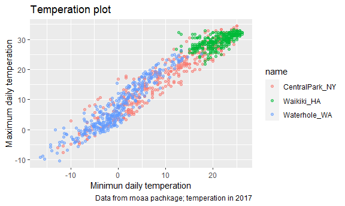
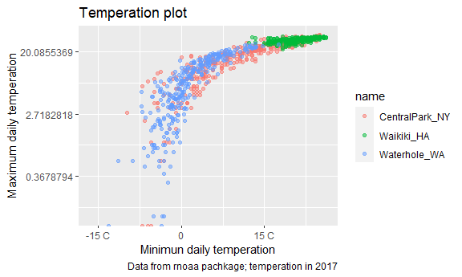
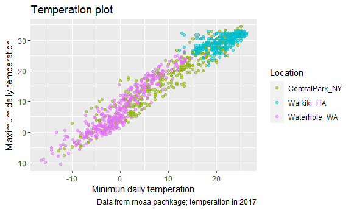
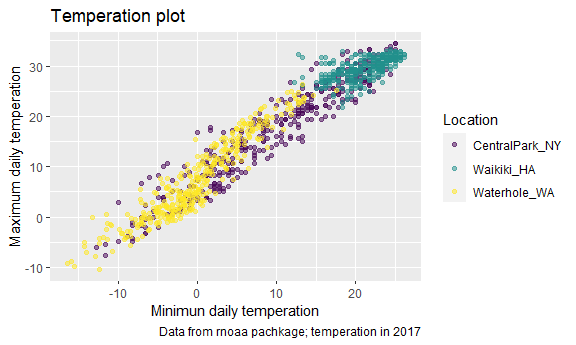
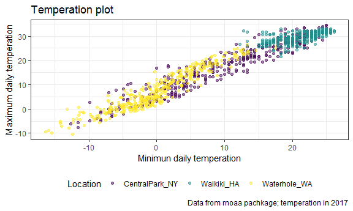

ggplot2
================

``` r
library(tidyverse)
```

    ## -- Attaching packages --------------------------------------- tidyverse 1.3.1 --

    ## v ggplot2 3.3.5     v purrr   0.3.4
    ## v tibble  3.1.4     v dplyr   1.0.7
    ## v tidyr   1.1.3     v stringr 1.4.0
    ## v readr   2.0.1     v forcats 0.5.1

    ## -- Conflicts ------------------------------------------ tidyverse_conflicts() --
    ## x dplyr::filter() masks stats::filter()
    ## x dplyr::lag()    masks stats::lag()

``` r
library(patchwork)
library(viridis)
```

    ## Loading required package: viridisLite

``` r
knitr::opts_chunk$set(
  fig.width = 6,
  fig.asp =.6,
  out.width = "90%"
)
```

Loading a dataset

``` r
weather_df = 
  rnoaa::meteo_pull_monitors(
    c("USW00094728", "USC00519397", "USS0023B17S"),
    var = c("PRCP", "TMIN", "TMAX"), 
    date_min = "2017-01-01",
    date_max = "2017-12-31") %>%
  mutate(
    name = recode(
      id, 
      USW00094728 = "CentralPark_NY", 
      USC00519397 = "Waikiki_HA",
      USS0023B17S = "Waterhole_WA"),
    tmin = tmin / 10,
    tmax = tmax / 10) %>%
  select(name, id, everything())
```

    ## Registered S3 method overwritten by 'hoardr':
    ##   method           from
    ##   print.cache_info httr

    ## using cached file: C:\Users\asus\AppData\Local/Cache/R/noaa_ghcnd/USW00094728.dly

    ## date created (size, mb): 2021-10-12 10:27:32 (7.62)

    ## file min/max dates: 1869-01-01 / 2021-10-31

    ## using cached file: C:\Users\asus\AppData\Local/Cache/R/noaa_ghcnd/USC00519397.dly

    ## date created (size, mb): 2021-10-12 10:27:47 (1.701)

    ## file min/max dates: 1965-01-01 / 2020-02-29

    ## using cached file: C:\Users\asus\AppData\Local/Cache/R/noaa_ghcnd/USS0023B17S.dly

    ## date created (size, mb): 2021-10-12 10:27:54 (0.914)

    ## file min/max dates: 1999-09-01 / 2021-10-31

``` r
weather_df %>% 
  ggplot(aes(x = tmin, y= tmax, color = name))+
  geom_point(alpha = .5)+
  labs(
    title = "Temperation plot",
    x = "Minimun daily temperation",
    y = "Maximum daily temperation",
    caption = "Data from rnoaa pachkage; temperation in 2017"
    )
```

    ## Warning: Removed 15 rows containing missing values (geom_point).



## Scales

``` r
weather_df %>% 
  ggplot(aes(x = tmin, y= tmax, color = name))+
  geom_point(alpha = .5)+
  labs(
    title = "Temperation plot",
    x = "Minimun daily temperation",
    y = "Maximum daily temperation",
    caption = "Data from rnoaa pachkage; temperation in 2017"
    )+
  scale_x_continuous(
    breaks = c(-15,0,15),
    labels = c("-15 C","0","15 C")
  )+scale_y_continuous(
    trans = "log"   ###y = sqrt/log(y)
    #position = "right"
  )
```

    ## Warning in self$trans$transform(x): NaNs produced

    ## Warning: Transformation introduced infinite values in continuous y-axis

    ## Warning: Removed 90 rows containing missing values (geom_point).



## COLOR scales

``` r
weather_df %>% 
  ggplot(aes(x = tmin, y= tmax, color = name))+
  geom_point(alpha = .5)+
  labs(
    title = "Temperation plot",
    x = "Minimun daily temperation",
    y = "Maximum daily temperation",
    caption = "Data from rnoaa pachkage; temperation in 2017"
  )+
  scale_color_hue(
    name = "Location",
    h = c(100,300)  #hue: color, tune of color
  )    
```

    ## Warning: Removed 15 rows containing missing values (geom_point).



``` r
weather_df %>% 
  ggplot(aes(x = tmin, y= tmax, color = name))+
  geom_point(alpha = .5)+
  labs(
    title = "Temperation plot",
    x = "Minimun daily temperation",
    y = "Maximum daily temperation",
    caption = "Data from rnoaa pachkage; temperation in 2017"
  )+
  scale_color_viridis(
     name = "Location",
    discrete = TRUE  #defalt is continuous for vridis
  )
```

    ## Warning: Removed 15 rows containing missing values (geom_point).



## Themes

``` r
weather_df %>% 
  ggplot(aes(x = tmin, y= tmax, color = name))+
  geom_point(alpha = .5)+
  labs(
    title = "Temperation plot",
    x = "Minimun daily temperation",
    y = "Maximum daily temperation",
    caption = "Data from rnoaa pachkage; temperation in 2017"
  )+
  scale_color_viridis(
     name = "Location",
    discrete = TRUE)+  #defalt is continuous for vridis
  theme_bw()+  
  ## ggthemes::theme_economist_white()+   # this package provides more themes
  theme(legend.position = "bottom")
```

    ## Warning: Removed 15 rows containing missing values (geom_point).



``` r
  ## Order matters for THEME!!
```
